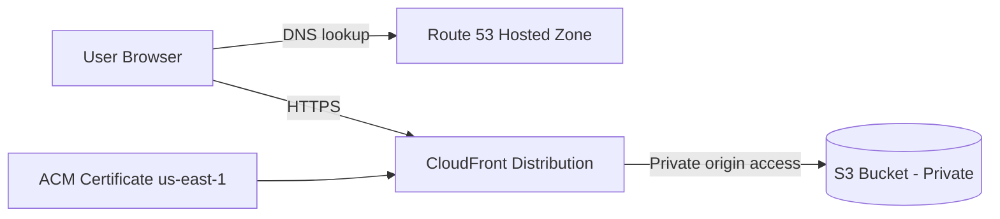

# FleurFit Landing Page — AWS CloudFront + Private S3 + Route 53 + ACM (HTTPS)

Live demo: https://fleurfit.com  
(CloudFront fallback URL): https://d3vp2xxks18x8n.cloudfront.net/

## Overview
This project is a secure, public-facing static website hosted on AWS. The site is served globally over HTTPS using Amazon CloudFront, with site assets stored in a **private** Amazon S3 bucket. DNS is managed in Route 53, and TLS certificates are issued by AWS Certificate Manager (ACM).

This repository contains the static site files, the architecture, and the deployment notes used to build the infrastructure.

## Architecture
- **Route 53**: DNS hosted zone for the domain
- **ACM (us-east-1)**: Public certificate for HTTPS on CloudFront
- **CloudFront**: CDN + HTTPS endpoint; redirects HTTP → HTTPS
- **S3 (private)**: Origin bucket containing `index.html` and assets; public access blocked

### Mermaid Diagram:

